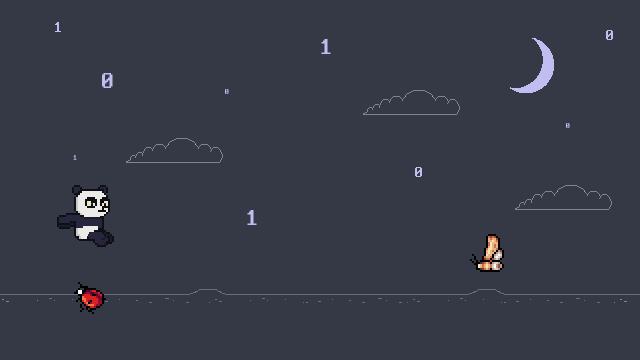

# Panda Game - Codecon

Este jogo foi criado durante um desafio no canal da [Codecon do Youtube](https://www.youtube.com/@codecondev). O objetivo foi progrmar este jogo em até duas horas, porém com duas pessoas mexendo no código ao mesmo tempo.

Aqui os detalhes do projeto:

-   Usando Phaser.js e Next.js
-   Já temos [layout pronto](https://www.figma.com/design/7IOoy3CZBslrHIbNd0JpwD/Joguinho-do-panda?node-id=0-1&t=2PgoDj3LF71FN71w-1) e os sprites também
-   Criar um jogo estilo T-Rex do Chrome
-   Só que no lugar do T-Rex será o Panda e ele pula por cima de bugs
-   O Panda pode coletar Patos como um especial, que deixa ele mais rápido e invencível por um tempo
-   Os pontos são contados para cada pixel que ele andar
-   Para cada pixel que ele andar, mais rápido fica
-   Tem insetos que ficam no chão e também a mariposa que vem voando
-   O Panda pode pular e agachar
-   Qualquer colisão dá tela de game over

# Sobre o projeto

Este é um modelo de projeto Phaser 3 que utiliza o framework Next.js. Ele inclui uma ponte para comunicação do React com o jogo Phaser, hot-reload para um fluxo de trabalho de desenvolvimento rápido e scripts para gerar compilações prontas para produção.

## Requerimentos

[Node.js](https://nodejs.org) é necessário para instalar dependências e executar scripts via `npm`.

## Comandos Disponíveis

| Comando               | Descrição                                                                                              |
| --------------------- | ------------------------------------------------------------------------------------------------------ |
| `npm install`         | Instala dependências do projeto                                                                        |
| `npm run dev`         | Inicia um servidor web de desenvolvimento                                                              |
| `npm run build`       | Cria uma compilação de produção na pasta `dist`                                                        |
| `npm run dev-nolog`   | Inicia um servidor web de desenvolvimento sem enviar dados anônimos (veja "Sobre log.js" abaixo)       |
| `npm run build-nolog` | Cria uma compilação de produção na pasta `dist` sem enviar dados anônimos (veja "Sobre log.js" abaixo) |

## Escrevendo Código

Após clonar o repositório, execute `npm install` a partir do diretório do seu projeto. Em seguida, você pode iniciar o servidor de desenvolvimento local executando `npm run dev`.

O servidor de desenvolvimento local roda em `http://localhost:8080` por padrão. Consulte a documentação do Next.js se desejar alterar isso ou adicionar suporte a SSL.

Assim que o servidor estiver em execução, você pode editar qualquer um dos arquivos na pasta `src`. O Next.js recompilará seu código automaticamente e recarregará o navegador.

## Estrutura de Projeto Modelo

Fornecemos uma estrutura de projeto padrão para você começar. É a seguinte:

-   `src/pages/_document.tsx` - Um ponto de entrada básico para um componente Next.js. É usado para definir as tags `<html>` e `<body>` e outras interfaces de usuário compartilhadas globalmente.
-   `src` - Contém o código-fonte do cliente Next.js.
-   `src/styles/globals.css` - Algumas regras CSS globais simples para auxiliar no layout da página. Você pode habilitar o Tailwind CSS aqui.
-   `src/page/_app.tsx` - O componente principal do Next.js.
-   `src/App.tsx` - Componente de middleware usado para executar o Phaser no modo cliente.
-   `src/game/PhaserGame.tsx` - O componente React que inicializa o Jogo Phaser e serve como uma ponte entre o React e o Phaser.
-   `src/game/EventBus.ts` - Um barramento de eventos simples para comunicação entre React e Phaser.
-   `src/game` - Contém o código-fonte do jogo.
-   `src/game/main.tsx` - O ponto de entrada principal do **jogo**. Ele contém a configuração do jogo e o início do jogo.
-   `src/game/scenes/` - As cenas do Phaser estão nesta pasta.
-   `public/favicon.png` - O favicon padrão do projeto.
-   `public/assets` - Contém os recursos estáticos usados ​​pelo jogo.
